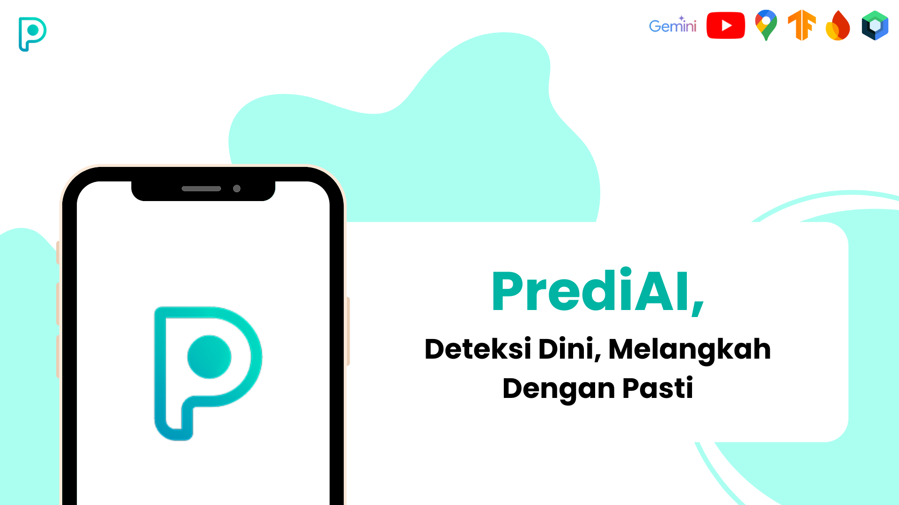
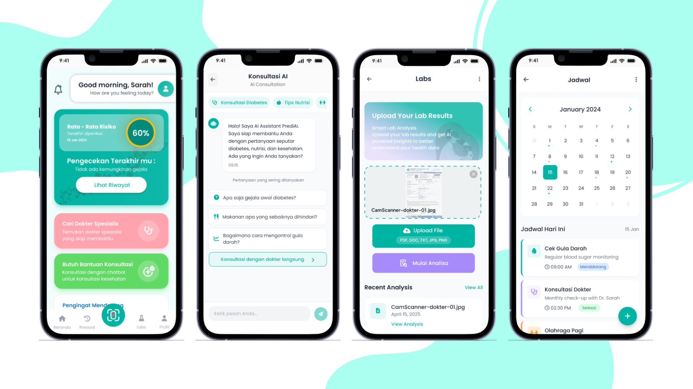
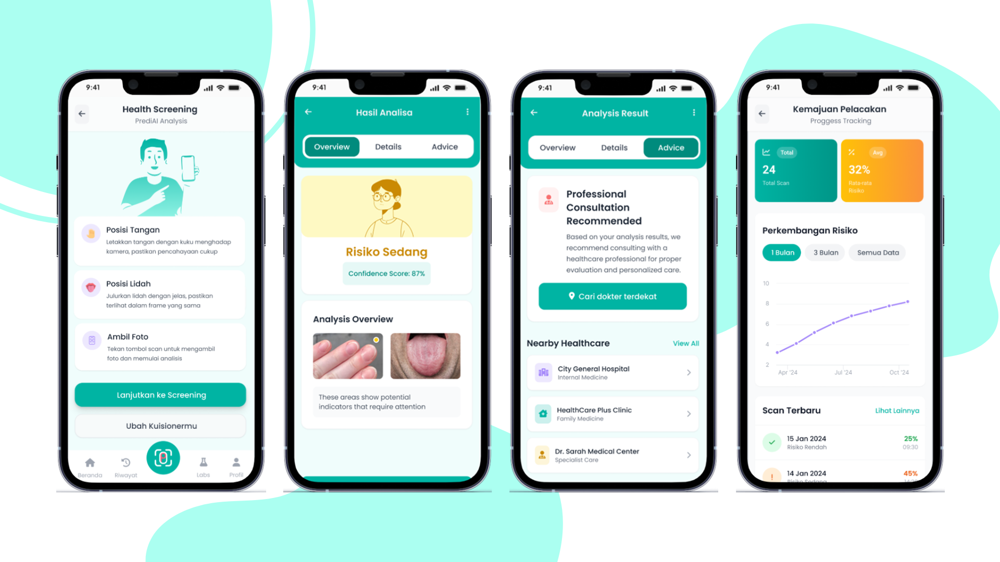

<h2 align="center">
  <b>PrediAI - Mobile App (Jetpack Compose) 👅💅🏻</b> 
</h2>

As a team passionate about **AI-driven healthcare innovation**, we build **PrediAI**, a mobile application designed for **non-invasive early screening of diabetes** through image analysis of **tongue and nail**, no needles, no pain.

Developed as part of **GEMASTIK XVIII**, a national software development competition organized by the **Ministry of Education, Culture, Research, and Technology (Kemendikbudristek)**, PrediAI empowers users to recognize early risk indicators of diabetes using just their smartphone camera.

PrediAI integrates **AI-powered image classification** based on **MobileNetV2** architecture, analyzing visual biomarkers correlated with hyperglycemia such as discoloration and texture changes in the tongue and nails. Combined with educational and tracking features, it bridges accessibility gaps in diabetes preventeion, making early detection **inclusive, practical, and affordable**.

Built using **Jetpack Compose, Firebase**, and **FastAPI**, PrediAI turns medical insight into a simple daily health companion for everyone. 💡

## ✨ Features (MVP)

The initial MVP of PrediAI includes five core features:
- 🩺 AI Screening : Upload tongue and nail photos for instant diabetes risk prediction.
- 📜 Examination History : Track your past screening results with timestamps and confidence levels.
- 🧠 AI Health Assistant : AI Chat-based assistant that provides personalized lifestyle and nutrition tips.
- 🧾 Lab Result Analysis : Upload lab reports for automatic data extraction and explanation.
- 📍 Nearby Health Facilities : Integrated map to find the nearest endocrinologist, clinic and hospital for follow-up care.

## 🛠️ Tech Stack

- Kotlin + Jetpack Compose (UI)
- Firebase (Authentication, Realtime Database)
- FastAPI (Backend API)
- TensorFlow + MobileNetV2 (Model for Image Classification)
- Gemini API (LLM-Based for Recommendation and Lab Reports Analysis)
- Google Maps API (Location features)
- YouTube API (Educational Features)

## 🧠 AI Model Repository

### 🛠️ Model Training & Research
These repositories contain the datasets, preprocessing scripts, and training notebooks for our core deep learning models.
- 💅🏻 [Nail Classification (CNN)](https://github.com/dzikrimr/prediai-nail-cnn) — Deep learning model training for nail-based diabetes risk detection.
- 👅 [Tongue Classification (CNN)](https://github.com/dzikrimr/prediai-tongue-cnn) — Deep learning model training for tongue-based diabetes risk detection.
- 📈 [Integrated Model Training](https://github.com/dzikrimr/prediai-tonguenail-train) — Centralized training pipeline for hyperparameter tuning and model evaluation.

### 🚀 Backend & Deployment Services
Production-ready services that handle real-time inference and data processing.
- ⚡ [AI Inference Service (FastAPI)](https://github.com/dzikrimr/prediai-tonguenail-service) — Main API service for model deployment and mobile app integration.
- 🎯 [YOLO Detection Service](https://github.com/dzikrimr/tonguenail-yolo) — Object detection service to ensure precise localization of tongue and nails before classification.
The diabetes risk analysis API, built with FastAPI and powered by a fine-tuned MobileNetV2 model, processes tongue and nail images using preprocessing pipelines.

The trained model achieves:
- 👅 Accuracy (Tongue) : 91.07%
- 💅🏻 Accuracy (Nail) : 94.98%
- 📈 F1-Score : Above 0.90 for both datasets

🔗 [YOLO Service](https://github.com/dzikrimr/YOLO-TongueNail-Service)
🔗 [Tongue & Nail Model](https://github.com/dzikrimr/prediai-tonguenail-service)

## 📸 Prototype

  

  

## 👥 Group Takeover
 
- [@Abdi](https://www.linkedin.com/in/muktiabdii/) — Product Manager
- [@Dzikri](https://www.linkedin.com/in/dzikri-murtadlo/) — Backend Developer
- [@Ade](https://www.linkedin.com/in/adenugroho/) — Frontend Developer
